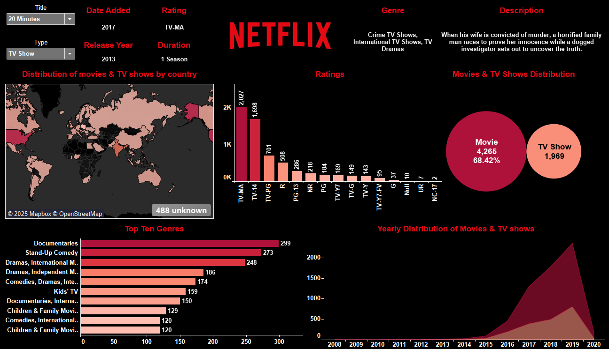

# 🎬 Netflix Global Content Analysis Dashboard

An interactive dashboard analyzing the entire Netflix content library to uncover strategic insights into its programming, genre focus, and global distribution.

---

## 📊 Live Interactive Dashboard

Explore the data and discover insights through the interactive dashboard built with Tableau.

**[Click here to view the interactive dashboard](https://public.tableau.com/app/profile/vivo.sorhie/vizzes)**

---

## Dashboard Preview

---

## Business Objective

This project analyzes the Netflix content catalog to provide a strategic overview for business executives. The key objectives were to:

* Understand the historical and current mix of movies versus TV shows.
* Identify the primary genres and maturity ratings that define the platform.
* Visualize the geographic footprint of Netflix's content production.

---

## Key Insights from the Dashboard

The analysis revealed several key trends in Netflix's content strategy:

* **Aggressive Pivot to TV Shows:** While movies still make up over 68% of the total library, the yearly distribution chart shows a massive acceleration in TV show acquisition and production starting around 2016, indicating a strategic shift towards subscriber-retaining series.

* **Focus on Niche & Factual Content:** Contrary to popular belief, **Documentaries** and **Stand-Up Comedy** are the top two genres. This suggests a strategy focused on attracting diverse audiences through high-value, non-fiction content.

* **Targeting Mature Audiences:** The content is heavily skewed towards mature viewers, with **TV-MA** being the most common rating by a significant margin—more than double the next category (TV-14).

---

## Technical Workflow

1.  **Data Sourcing:** Utilized a publicly available Netflix dataset from Kaggle.
2.  **Data Cleaning & EDA:** Performed data cleaning and exploratory data analysis (EDA) using Python (Pandas) to prepare the dataset for visualization.
3.  **Dashboard Development:** Designed and built an interactive dashboard in Tableau, featuring geographic maps, trend charts, and dynamic filters for an intuitive user experience.

---

## Tech Stack

* **Programming Language:** Python
* **Libraries:** Pandas (Data Manipulation)
* **BI & Visualization:** Tableau
* **Version Control:** Git & GitHub
